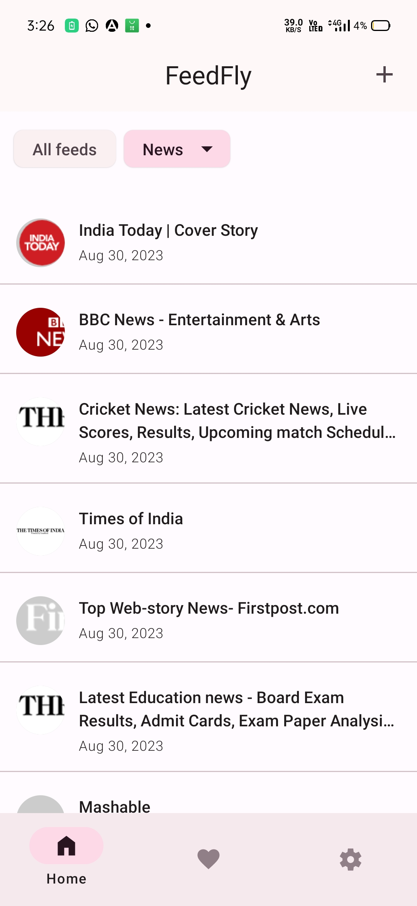
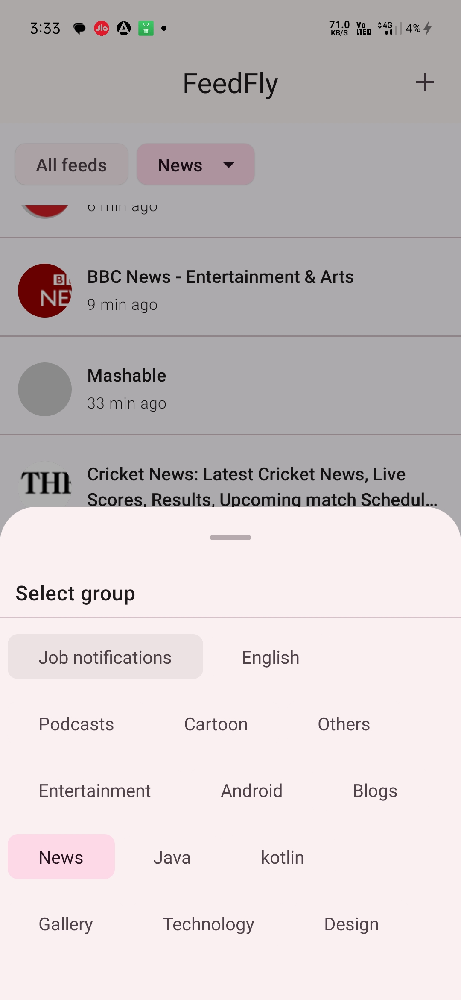
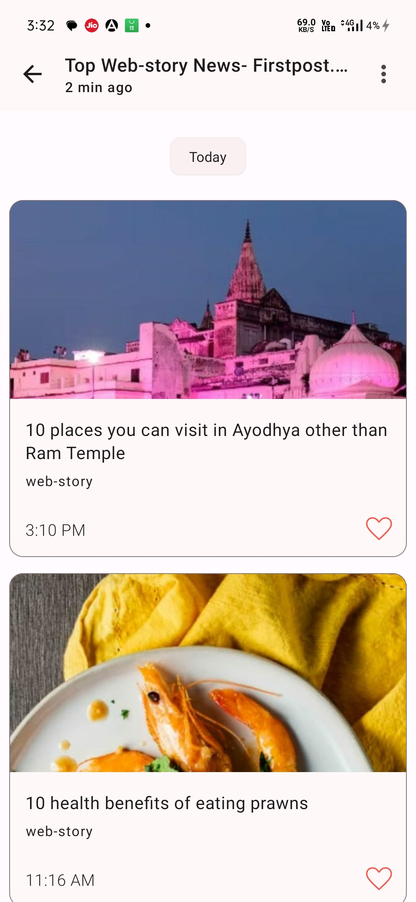

 

# FeedFly - Read News on the Fly

## Overview

FeedFly is a sleek and efficient RSS feed reader designed to provide users with a seamless and personalized news-reading experience. 
With a focus on simplicity, speed, and customization, FeedFly empowers users to stay informed on their favorite topics without compromising on design or functionality.

## Screenshots

  
  ◯
  
  ◯
  
  ◯
  

## Key Features

- Users can effortlessly add their preferred RSS feed URLs, allowing them to curate a personalized news stream.
- FeedFly intelligently parses and presents content, including images and text, from the provided RSS feeds.
- All parsed content is stored in SQLite, ensuring offline access to news articles even without an internet connection.
- FeedFly respects the original content from the feeds and does not modify or manipulate the information provided.
- Users can customize and group their feeds based on categories like Android, Sports, News, etc., streamlining the news-reading process.

### Tech Stack

- **Android SDK**: Utilizing the power of Android development for a native and responsive user experience.
- **Kotlin**: Leveraging the modern programming language to enhance code readability and conciseness.
- **Jetpack Compose**: Embracing the latest UI toolkit for building native Android UIs with a declarative syntax.
- **Material You Theming**: Employing the latest design principles for a visually appealing and customizable interface.
- **Clean Architecture**: Ensuring maintainability and scalability by implementing a clean and modular architectural approach.

## How to Use

1. Launch FeedFly on your Android device.
2. Add your favorite RSS feed URLs.
3. Explore personalized news feeds with rich content.
4. Customize feed categories for efficient news organization.
5. Enjoy offline access to your curated news articles.

## Getting Started

1. Clone the repository.
2. Open the project in Android Studio.
3. Build and run the app on your device or emulator.

## License

FeedFly is licensed under the [MIT License](LICENSE.md). Feel free to use, modify, and distribute the code as per the terms of the license.

## Acknowledgments

Special thanks to the open-source community, contributors, and libraries that made FeedFly possible.
